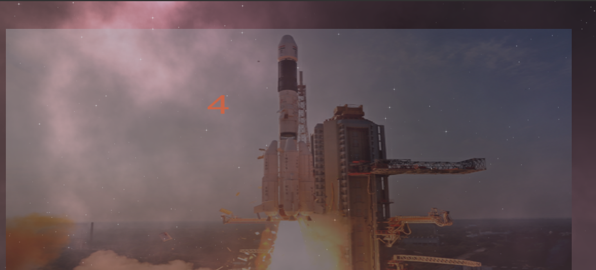
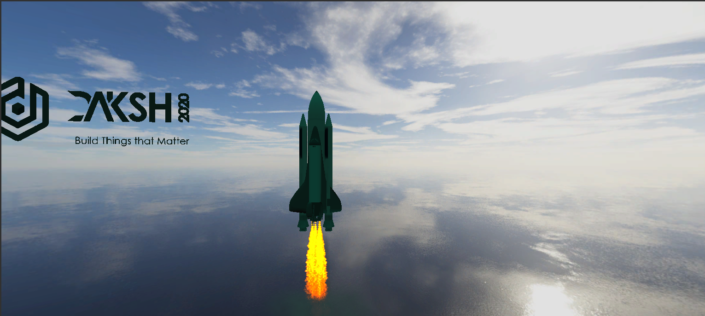
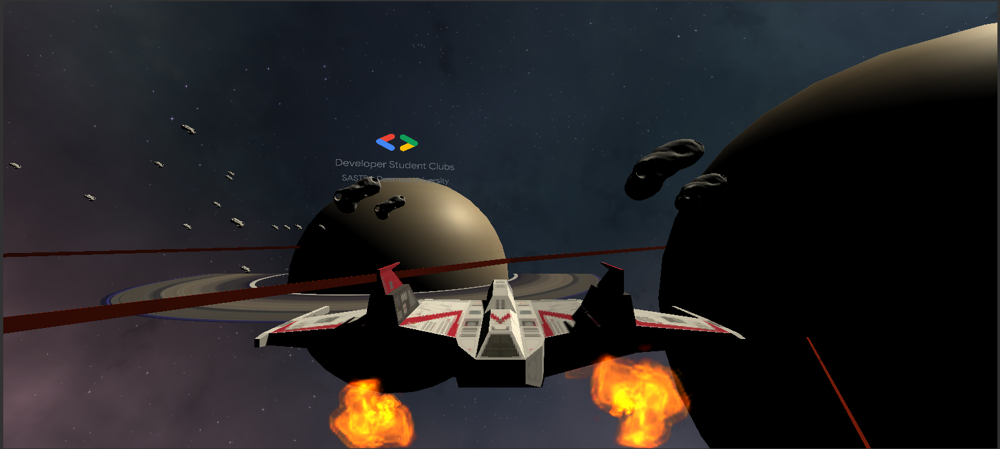
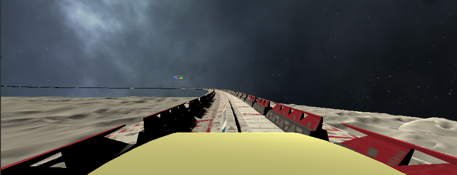

# VR-Space-Exploration
We,DSC SASTRA Deemed To Be University, the AR/VR Cluster have made a VR Project on Space Exploration.This is a project made to make people experience the Space Tour from the launch to the Roller Coaster ride on Moon.This project is made with several scene transitions.
                       The scene in Oculus Go will start with a launch countdown and then rocket launch further to the Space Exploration and finally gets ended with a small roller coaster ride on the Moon.The project was made in Unity 3D.
                       The project was made to create a immersive effect for the people to experience.
 ## Countdown :
  
 ## Launch :
  
 ## Space :
 
 ## Roller Coaster : 
 

